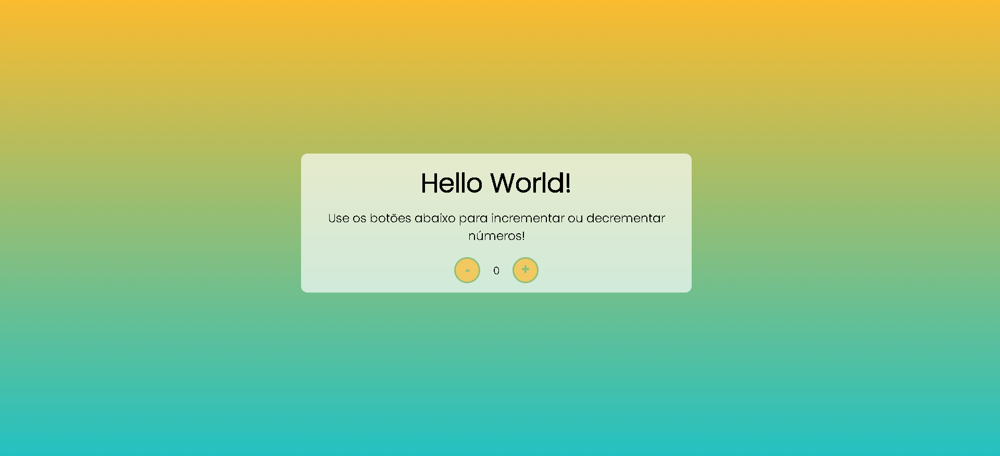

# Contador |HTML, CSS e JavaScript.</h1>

Minha primeira página utilizando JavaScript. O contador foi desenvolvido nas aulas do curso de JavaScript através do bootcamp Decola Tech 3a edição na plataforma Digital Innovation One junto com Avanade.  
Para acessá-lo, <a href="https://amandavsadev.github.io/contador-DIO/index.html" target="_blank"> Clique aqui</a>!</li>

